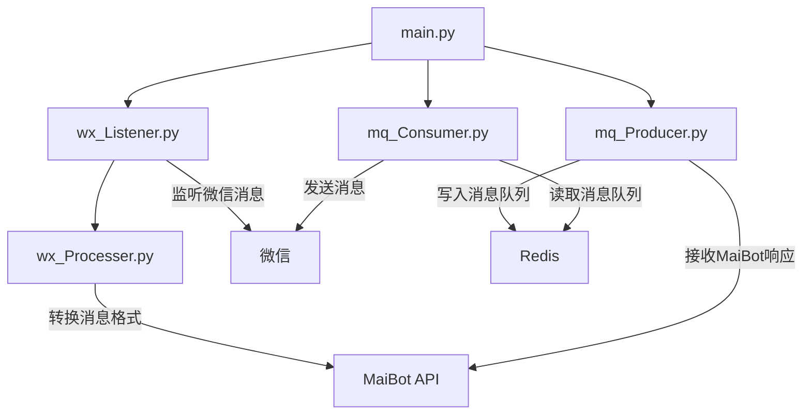

# WeMai - 微信分麦

<div align="center">
  
  
  
</div>

## 📝 项目简介

**🚀 WeMai是一个微信消息双向转发系统**

- 💬 **微信监听**：实时监听微信消息并转发
- 🔄 **双向通信**：支持微信→MaiBot和MaiBot→微信双向消息传递
- 🔧 **灵活配置**：支持通过环境变量自定义配置
- 🛡️ **稳定可靠**：自动监控和重启机制
- 🔄 **消息队列**：使用Redis作为消息中间件

## 🎯 功能特性

| 模块 | 主要功能 | 特点 |
|------|---------|------|
| 🔄 **消息转发** | • 微信消息→MaiBot<br>• MaiBot回复→微信<br>• 消息格式转换<br>• 消息去重 | 双向通信 |
| 🛠️ **统一管理** | • 统一入口<br>• 命令行参数<br>• 自动重启<br>• 优雅停止 | 稳定可靠 |
| 🔧 **灵活配置** | • 环境变量配置<br>• 聊天对象过滤<br>• 自定义监听范围 | 易于定制 |
| 🔍 **消息过滤** | • 自动过滤自己发送的消息<br>• 排除系统消息<br>• 自定义排除列表 | 精准转发 |
| 📊 **日志记录** | • 详细日志<br>• 群组ID哈希映射<br>• 错误追踪 | 便于排查 |

## 🚀 快速开始

### 环境要求

- Python 3.8+
- 微信桌面版（3.9.11.17）
- Redis服务器

### 安装步骤

1. 安装redis,记录你的redis服务器地址及端口，用于.env文件修改，本地远端均可

2. 安装maibot，参考https://github.com/MaiM-with-u/MaiBot
   > [!INFO]
   > - 请自己研究maibot，找到适合自己的部署方式。
   > - 这里仅提供部署思路，maibot本质上是一个完善的闭环机器人，她拥有消息收发处理机制
   > - 消息的循环在于其内部构建的消息链，类似于人的思考和回复
   > - 因此，你可以将她当作一个独立的机器人，自己创建一个机器人框架和她进行交互（本项目基于此思路实现）。
   > 详细处理逻辑和maibot部署方式可参考：https://mp.weixin.qq.com/s/79ZdJqZ7VI0bFsg14Hf00w
   > - 注意记录服务器地址和ip，后续修改.env环境变量要用到

3. 运行本项目
   > 如果看完了前两步，你应该部署好了属于自己的redis数据库和maibot
   > 那么，可以开始部署和运行本项目了
   ```bash
   git clone https://github.com/yourusername/wemai.git
   cd wemai
   pip install -r requirements.txt
   cp .env.example .env
   # 编辑.env文件，配置你的环境变量
   python main.py
   ```
   > - 在完成.env文件的修改后，初次运行启动命令，你将在控制台看到类似于：
   > - 2025-05-01 16:18:18 - INFO -   test -> 098f6bcd4621d373cade4e832627b4f6
   > - 这样的log信息，这里记录了你在本项目设置的聊天白名单，其中包含的就是你的群组id
   > - 将这个id复制粘贴到你的maibot的bot_config中，重新运行maibot就可以完成群聊交互

### 本项目命令行参数

```
usage: main.py [-h] [--all] [--wx-to-maibot] [--maibot-to-wx] [--target-chats TARGET_CHATS]

WeMai - 微信消息转发服务

optional arguments:
  -h, --help            显示帮助信息
  --all                 启动所有服务（默认）
  --wx-to-maibot        仅启动微信到MaiBot的消息转发
  --maibot-to-wx        仅启动MaiBot到微信的消息转发
  --target-chats TARGET_CHATS
                        要监听的微信聊天对象，多个用逗号分隔
```

## 📐 系统架构



## ⚙️ 配置说明

WeMai使用`.env`文件进行配置，主要配置项包括：

| 配置项 | 说明 | 默认值 |
|-------|------|-------|
| WX_TARGET_CHATS | 要监听的聊天对象列表 | 空（由命令行参数决定） |
| WX_LISTEN_ALL_IF_EMPTY | 是否监听所有聊天 | false |
| WX_EXCLUDED_CHATS | 排除的聊天对象 | 文件传输助手,微信团队,微信支付 |
| MAIBOT_API_URL | MaiBot API地址 | http://your-ip:your-port/api/message |
| REDIS_URL | Redis连接地址 | redis://your-ip:your-port |
| REDIS_QUEUE_KEY | Redis队列键名 | autoText |
| API_HOST | API监听地址 | 0.0.0.0 |
| API_PORT | API监听端口 | 8000 |

## 📋 使用说明

1. **配置MaiBot白名单**
   
   启动程序后，控制台会显示监听的聊天对象及其哈希ID，将需要的群组ID添加到MaiBot的白名单中。

2. **消息流向**

   - **微信→MaiBot**：监听微信消息，转换格式后发送到MaiBot API
   - **MaiBot→微信**：接收MaiBot响应，通过Redis队列转发到微信

3. **自动过滤**

   - 自动过滤自己发送的消息
   - 自动过滤系统消息
   - 可配置排除特定聊天对象

## 📌 注意事项

> [!WARNING]
> - 本项目仅供学习交流使用，请勿用于非法用途
> - 尽管UI自动化相对来说风险较小，但小不等于没有封号风险，请谨慎使用
> - 项目处于开发阶段，可能存在未知问题
> - 使用前请确保已了解并同意微信相关协议


## 📝 许可证

本项目采用 MIT 许可证 - 详情请参阅 [LICENSE](LICENSE) 文件

## 🙏 致谢

- [MaiBot](https://github.com/MaiM-with-u/MaiBot) - 提供API接口支持
- [wxauto](https://github.com/cluic/wxauto) - 提供微信自动化支持
- [wepush](https://github.com/friend-nicen/wepush) - 提供框架设计基础及灵感
- 所有贡献者和使用者
